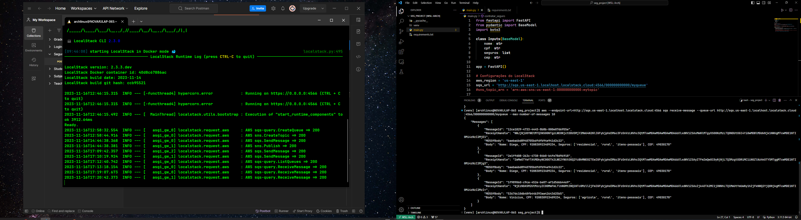

# NOVA - Contratação de Seguro
### Python, Fastapi, Localstack, SQS e SNS.

#### Principais comandos AWS-CLI:
1. aws --endpoint-url=http://localhost:4566 sqs create-queue --queue-name myqueue
2. aws --endpoint-url=http://localhost:4566 sns create-topic --name mytopic
3. aws --endpoint-url=http://sqs.us-east-1.localhost.localstack.cloud:4566 sqs list-queues
4. aws --endpoint-url=http://sqs.us-east-1.localhost.localstack.cloud:4566 sqs receive-message --queue-url http://sqs.us-east-1.localhost.localstack.cloud:4566/000000000000/myqueue
5. aws --endpoint-url=http://sqs.us-east-1.localhost.localstack.cloud:4566 sqs receive-message --queue-url http://sqs.us-east-1.localhost.localstack.cloud:4566/000000000000/myqueue --max-number-of-messages 10